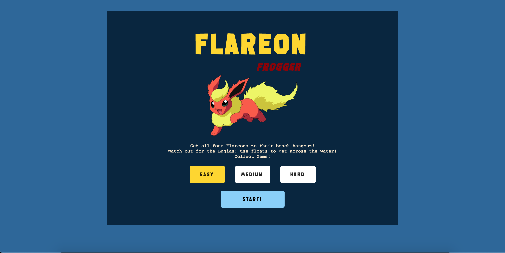
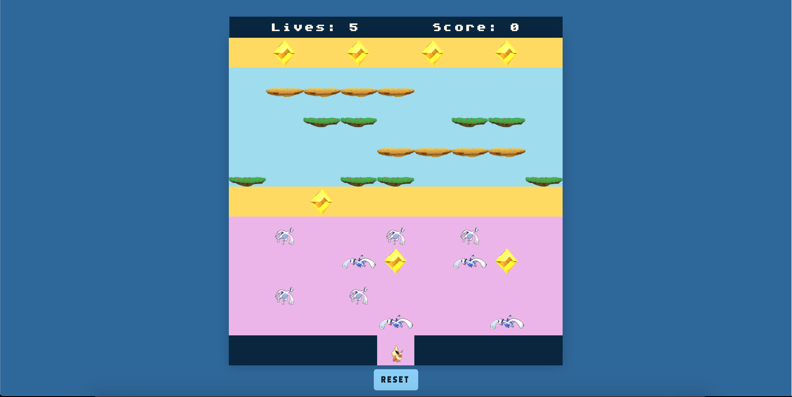
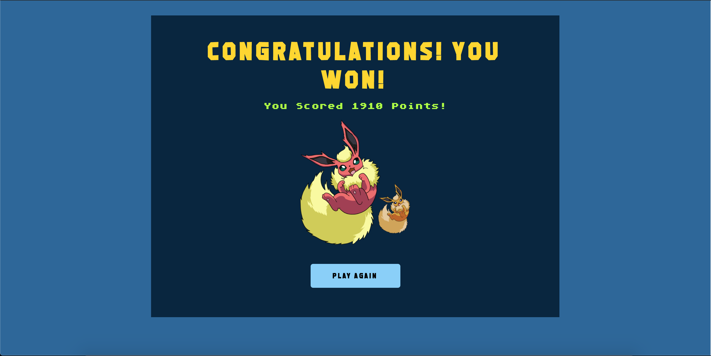
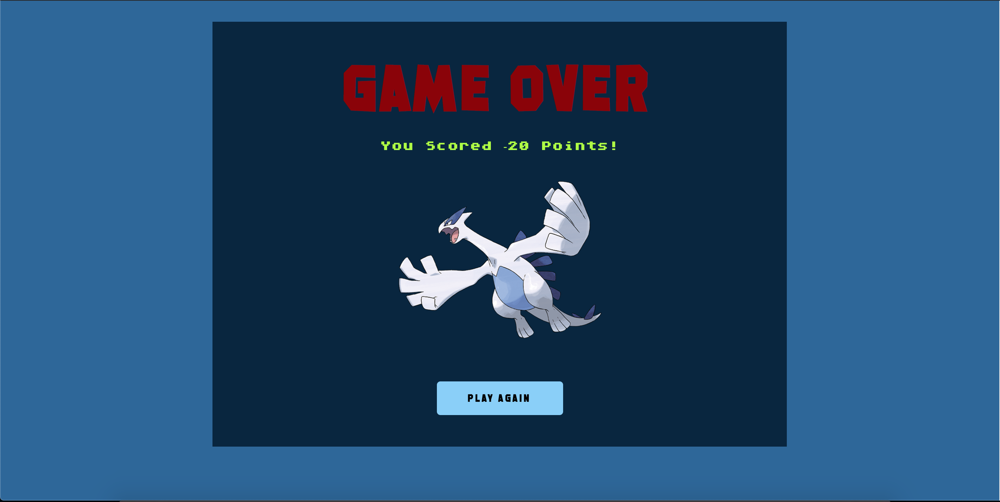

 
# Project 1: Flareon Frogger 

## Overview

This is my take on the classic game Frogger. It was my first project on my Software Engineering Immersive course at General Assembly. The time frame for this project was 9 days.


## Deployment 

Launch on GitHub Pages [here](https://ybl123.github.io/sei-project-one/)


## Built with

HTML5
CSS3
JavaScript (ES6)
Git
GitHub

## Getting Started

Clone or download the repo. Then open the index.html file in your browser to play the game. The game should be compatible with all browsers.








## Brief 

Render a grid-based game in the browser
Design logic for winning & visually display which player won
include separate HTML/CSS/JavaScript files
Use Javascript for DOM manipulation
Deploy your game online
Use semantic markup for HTML and CSS (adhere to best practices)

## Game 

The concept for my game is to guide the group of 4 Flareons, one by one to the other side of the board. Once the player reaches an end point, the next Flareon is spawned. The player must navigate through moving obstacles in the first section. Then in the second section, use the floats to get passed the water and on to the end points. 

To move the Flareons the player uses the arrow keys. For horizontal movement this would be +/-1 and +/- width for vertical movement. I gave each key a different gif of Flareon so that, whichever direction the player turned the gif of Flareon will align. Before starting the game the player selects at what difficulty they would like to play. With 'easy' the player will start out with 5 lives, 3 for 'medium' and 1 for 'hard'.

### Movement

```javascript
  function handleKeyDown(event) {
    const x = flareonPosition % width
    const y = Math.floor(flareonPosition / width)
    switch (event.keyCode) { 
      case 39:
        if ((x < width - 1) && (!cells[flareonPosition + 1].classList.contains('flareona'))) { 
          resetFlareonOnFloat()
          flareonPosition++ 
          addPlayer('flareonRunRight')
        }
        break
  ...
```

### Difficulty

```javascript
  function gameDifficulty(event) {
    difficultyButtons.forEach(button => {     
      button.classList.remove('active-button')
    })
    this.classList.add('active-button')  
    switch (event.target.value) {
      case 'easy':
        chosenDifficulty = 'easy'
        playerLives = 5
        break
  ...
```

## Moving object collision

If Flareon and one of the enemy classes are in the same div then there will be a collision. I added an explosion gif at the point of collision.

//* inset code snippet of collision and explosion gif 


## Float collision

I also had to take into account when the Flareon would need to get on the floats. I made it so the Flareon is always one step behind the float, this allows it to appear as though the Flareon is jumping onto the float. 

//* insert code snippet of flareon jumping onto float

I added another css class that would display Flareon with the float in the background

//* insert code snippet of CSS


## Water danger zone

If player is in this area and not on a float they will die. I added a splash gif for the point of 'collision'.

//* insert code snippet of water danger zone

## Audio

I Added background music that starts when the game begins and loops continuously during game play. If the player wins the game then a win window pops up. The background music is paused and a 'victory' sound clip is played, (not on a loop). If the player loses the game then a game over window pops up. Once again the background music is paused and a 'game over' sound clip is played, (not on a loop). If the player clicks the reset button, they are taken back to the main menu and the background music is also paused. 

//* insert code of sounds 

## Win Condition

Once all four Flareons have reached an end point the game is won.
There are also gems for the player to collect for an extra 50 points each.
The player is awarded different end game game points depending on the difficulty level selected. If the game is completed on easy, the player is rewarded 500 points. 800 points for medium and finally 1000 points for hard.


## Lose condition

If the player collides with the moving obstacles in section one, the player will 'die'. This will result in losing one life and losing 20 points. The same will happen if the player falls into the water in section two.
If all lives are lost then game over.

## Wins and Challenges

The biggest challenge and win was getting the floats to work. The function I had initially written didn't take into account that the player would need to move left or right on the float. It was written in a way that only allowed the player to move left. 
To fix this function I had to check whether the position of Flareon was 'on' a float with the boolean playerOnFloatFlag. Then check whether the player's future position is going to be left or right, and move them accordingly.

I'm quite happy with the styling of the game although there are definitely improvements that can be made. 


## Bugs

glitch on floats - if jumping on at the edge of the index. The player is sometimes moved on to the next row of floats above.


## Future Improvements

Creating a phone-friendly version
Mute audio option
Other player character selection options
Additional levels with increasing difficulty/complexity
High score feature + entering name for high score board
2 player option
Countdown to complete the game option
Smoother image transistion
Improved graphics + get background images to work with the moving objects and Flareon.
Additional point system like the classic frogger. When you move up the board +10 points. But make the function calculate it so that the player is only awarded the points for progressing up the board once. So that if the player goes down and then up again they wouldn't be awarded the points for making the same progression. 
Also being able to carry an extra chracter like in the classic frogger for extra points.


## Credits

Starter Code: Jack May - General Assembly